  

  3rd Year Data Science · CHRIST University, Pune

 

  

 

<table>
<tr>
<td width="33%" valign="top">

###  Intelligence

**[COGNITO](https://github.com/Dxv-404)** — Studies why RL agents develop distinct personalities under distribution shift. Custom Minecraft-inspired gridworlds, 4 research documents.

**[STRIDE](https://github.com/Dxv-404)** — Genetic algorithm evolves bipedal walking from scratch. 6 joints, 18 parameters, 7,500 simulated lifetimes. Beat CMA-ES.

**[CROSSROADS](https://github.com/Dxv-404)** — Multi-agent RL at an unsignaled intersection. No rules taught. Different reward regimes produce wildly different driving cultures.

</td>
<td width="33%" valign="top">

###  Creation

**[DHWANI](https://github.com/Dxv-404)** — Turns datasets into music using linear algebra. Eigenvalues → pitch, eigenvectors → instruments, PCA → melody. 12 interactive modules.

**[NEUROTOME](https://github.com/Dxv-404)** — Lobotomize a neural network and watch predictions break. Grad-CAM across 50+ layers, 4+ architectures. Real-time surgery.

**[AAWAZ](https://github.com/Dxv-404)** — Gesture-controlled music player. Five hand gestures via MediaPipe, ~30fps inference. No buttons, just a webcam.

</td>
<td width="33%" valign="top">

###  Systems

**[INK](https://github.com/Dxv-404)** — Educational dashboard disguised as a pixel-art game. 15+ draggable widgets, triple auth, coin-based Q&A bounties, Spotify integration.

**[AFWAH](https://github.com/Dxv-404)** — Simulates how the same rumor spreads differently on WhatsApp vs Twitter vs Reddit. 10K Monte Carlo iterations per config.

**[ARIVU](https://github.com/Dxv-404)** — Citation lineage tracker that labels each edge with the specific idea inherited, not just "A cites B." NLI + semantic similarity.

</td>
</tr>
</table>

 

  &nbsp;&nbsp;
  &nbsp;&nbsp;
  &nbsp;&nbsp;
  &nbsp;&nbsp;
  &nbsp;&nbsp;
  &nbsp;&nbsp;
  &nbsp;&nbsp;
  &nbsp;&nbsp;
  &nbsp;&nbsp;
  &nbsp;&nbsp;
  &nbsp;&nbsp;
  

 

  
  &nbsp;&nbsp;
  

 

  All project names are Sanskrit/Hindi. It's a thing.

<!--
  You're reading the source. Here's your reward:
  devkrishns.work@gmail.com
  
  Registration: 23112015
  Languages spoken: English, Hindi, Malayalam, Tamil, Marathi
-->
