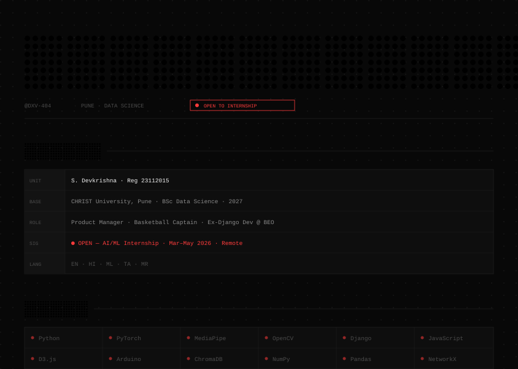
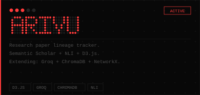
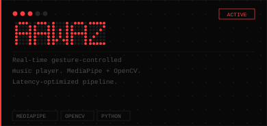
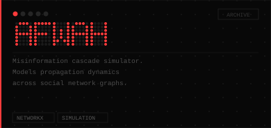

 

<table>
<tr>
<td align="center" border="0">

</td>
<td align="center" border="0">

</td>
</tr>
<tr>
<td align="center" border="0">

</td>
<td align="center" border="0">

</td>
</tr>
<tr>
<td align="center" border="0">

</td>
<td align="center" border="0">

</td>
</tr>
</table>

 

&nbsp;

