<!--
  ─────────────────────────────────────────────────────────────────────
  github.com/Dxv-404  ·  profile README
  ─────────────────────────────────────────────────────────────────────
  Every image is a generated, standalone SVG. Don't hand-edit them.
  Panels (02-05, 14-15): change copy in the DATA block at the bottom of
  tools/build.py, then:

      cd tools && python3 build.py ../assets

  Project cards (06-13): a painting per repo in tools/cards/src, framed by
  tools/cards/card.py. Change a card's spec in that file's CARDS dict, then:

      python tools/cards/card.py <id>

  Cards fade in on load, staggered down the grid (reveal= in each spec).

  The ending (16_ending_*.svg) is the header's hill again, at dusk: the figure
  pinning the live apps to a board. Six slices of one scene, side by side, the
  four note slices linked. Built by tools/ending/ending.py from the header's
  layers and the painted kit in tools/ending/kit:

      python tools/ending/ending.py

  It does not follow the clock; only the hero does.

  The hero is ONE file, assets/01_hero.svg. Do NOT edit it by hand:
  .github/workflows/hero.yml regenerates it every three hours for the real
  time of day in IST and the week's commit count, and a manual edit is
  overwritten on the next run. Its layers and assembler live in tools/header/.

  Built to survive GitHub's image pipeline:
    · no webfonts   — display type is drawn as vector pixel runs
    · no JavaScript — motion is CSS animation inside each SVG
    · no <use> across files — each file is fully self-contained
    · prefers-reduced-motion respected; every asset has a still state
    · every panel carries <title>/<desc>, mirrored in the alt text below
  ─────────────────────────────────────────────────────────────────────
-->

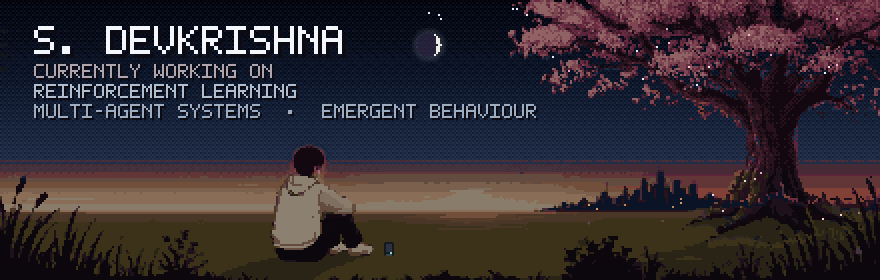

<a href="https://github.com/Dxv-404/G-ONE">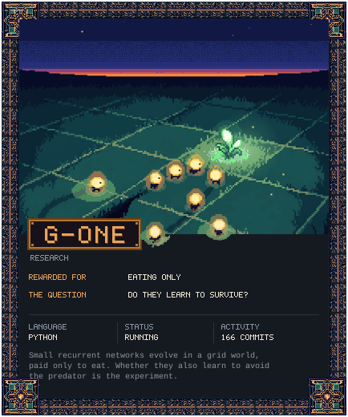</a><a href="https://github.com/Dxv-404/crossroads-rl">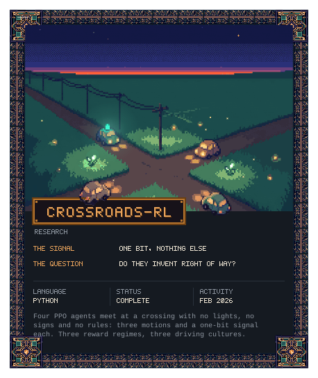</a><a href="https://github.com/Dxv-404/stride">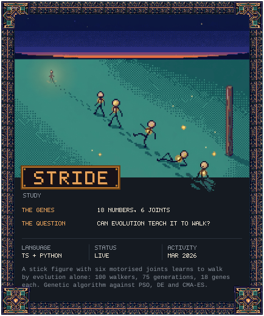</a>

<a href="https://github.com/Dxv-404/Arivu">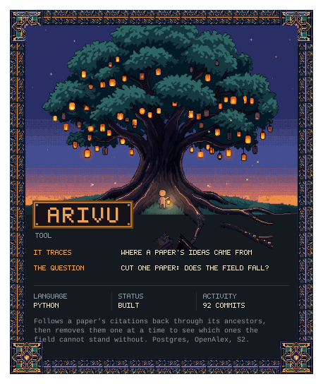</a><a href="https://dxv-404-apin.hf.space">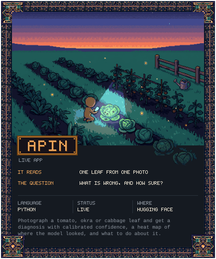</a><a href="https://github.com/Dxv-404/Afwah">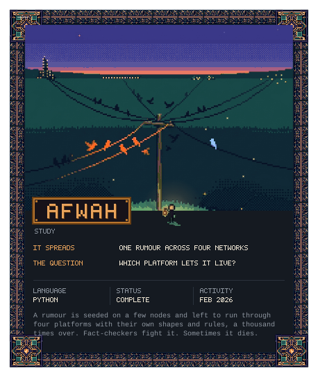</a>

<a href="https://github.com/Dxv-404/adr-system">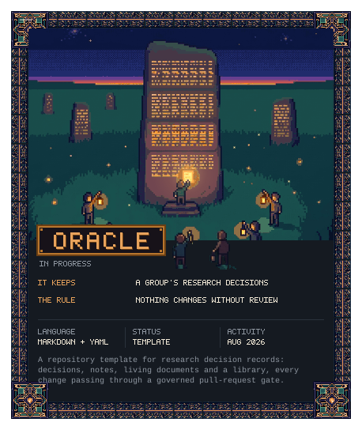</a><a href="https://github.com/Dxv-404/ink-education">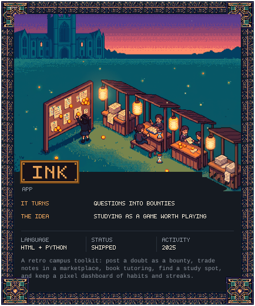</a>

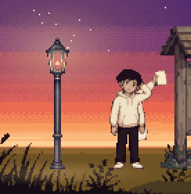<a href="https://dxv-404-apin.hf.space">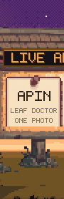</a><a href="https://oracleonline.app">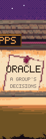</a><a href="https://www.stridewalk.fun">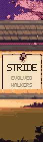</a><a href="https://github.com/Dxv-404/ink-education">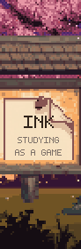</a>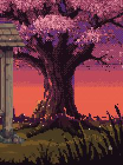

